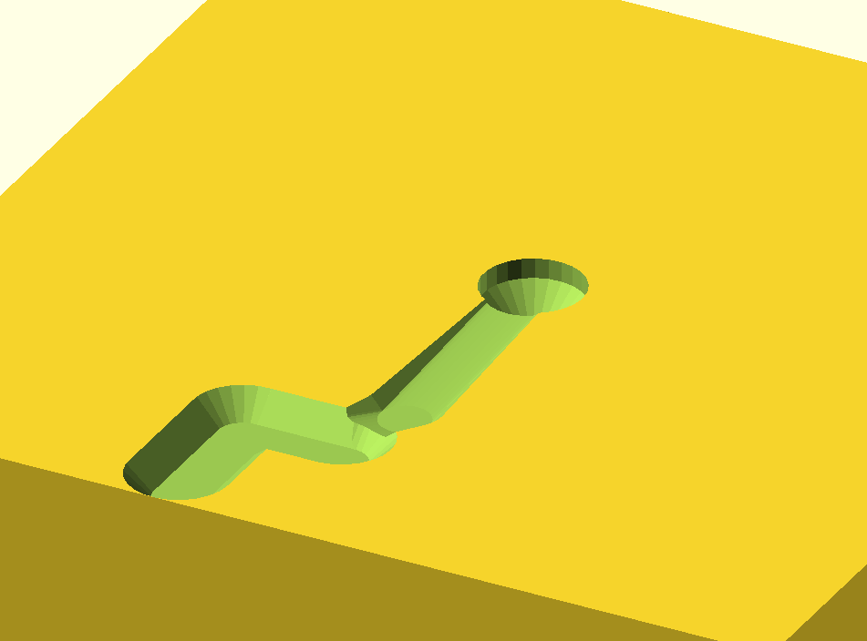

# 3-axies CNC emulation library for OpenSCAD
This library is an extension for OpenSCAD to emulate the operation of a 3-axies CNC (Computer Numerical Control) machining.



The library provides a simple-to-use API function named `cut`. 
This function is used to perform CNC operations on a solid block as in this example. 
```
cut(path, 
    name = tool_type,
    h= tool_height,
    d0 = tool_ext_diameter,
    d1 = tool_int_diameter,
    a= tool_angle,
    speed = tool_speed,
    show = tool_show, 
animate=tool_animate)
    translate([0,0,-70])
        cube([400,400,140], true);
```
The cut function takes several parameters:

- path: This is likely the path that the tool should follow on the block. This is a 3-axis position of the cutting tool, it referrer as [0,o,0] to the center of the rotation of the tool for X,Y and the base of the tool for Z axis.

*cutting tool's parameters*
- name: This parameter is used to specify the type of the tool. It must be one of the following: cylinder, conic, spheric, or profile shape.

- h: This represents the height of the tool.
- d0: This is the external diameter of the tool.
- d1: This is the internal diameter of the tool.
- a: This represents the angle of the tool.

*CNC operation parameters*
- speed: This is the speed in mm/s of the tool.
- show: This parameter is likely used to control whether the tool is shown or not.
- animate: This parameter is likely used to control whether the operation is animated or not.

The cutting toll start from the begin of the path to cut the block. 

## Cutting tool supported
Only 4 types of cutting tools are supported: cylinder, conic, spheric, and profile


Below the parameters to setup the cutting tool, use the same parameters in the `cut` API.

```
create_tool(name="cylinder", h=10, d0=5);
translate([20,0,0])
    create_tool(name="conic", h=10, d0=5, d1=2, a=60);
translate([40,0,0])
    create_tool(name="spheric", h=10, d0=5);
translate([60,0,0])
    create_tool(name="profile", h=10, d0=5, d1=2);
```
## Cutting tool's path
The cutting tool following the path points provided by the parameter path that is a list of [x,y,z] vector, like this:
```
path=[
[0,0,0],
[0,0,-18],
[0,0,0],
[0,100,-5],
[10,120,-1],
[10,130,-10],
[50,130,-10],
[50,180,-10]
];
```
## Animation and Show Tool
The paramater amimante allo to animate the cutting process over the time, to activate this use Animate in the view.


The tool operation and path can be showed by activete it with the paramater show_tool.


## Create path API
The cnc_path.scad libary help to create catting path using primitive like move_to o move_by and circular arc.
See [path example here](./examples/cnc_path_test_arc.scad)

This is a library of functions to create paths in 3D space
The functions are used to create paths for the extrusion of 3D shapes

The functions are:
```
start(x,y,z) - creates a path starting at the given point
move_by(by, path) - moves the path by the given vector or scalar
move_to(to, path) - moves the path to the given point
up(to, path) - moves the path up the cutting tool by the given amount
down(to, path) - moves the path down the cutting tool by the given amount
circolar_move(radius, nornal=undef, dir="right", arc=360, path) - creates a circular path segment ($fn is used to determine the number of segments, default is 10)
```

for example this code generate the following path:
```
path = circolar_move(radius=10, arc=90, path=
        move_by(20,
            circolar_move(radius=30, arc=180,  path=
            circolar_move(radius=30, arc=120, dir="l", path=
             move_by([30], 
                start(0,0,0))))));
```


## Features to be added
- Change cutting tool over the path


